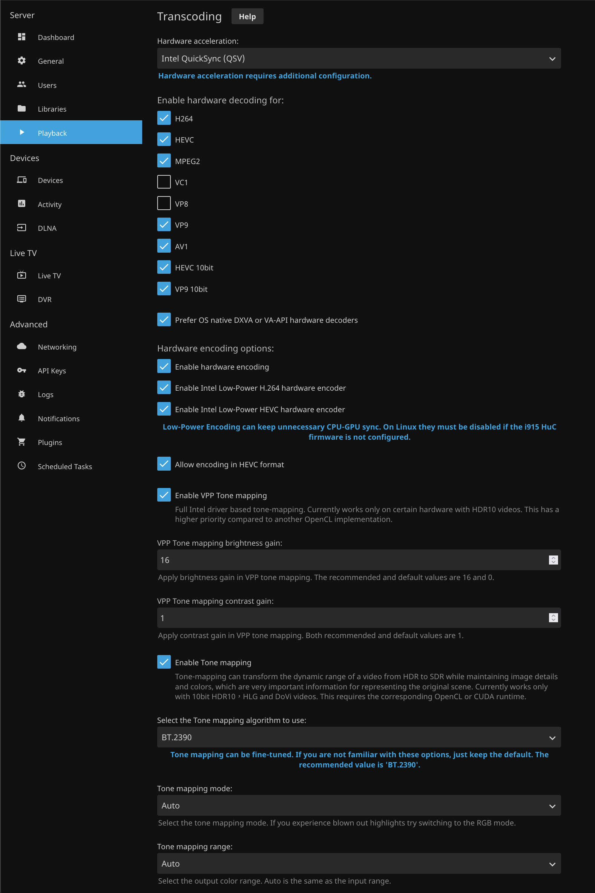

# Jellyfin

## Setup

Ensure NAS is bridging network so VMs can connect to it.
See: https://www.truenas.com/community/threads/vm-cannot-connect-to-host-smb.92805/
Note: VMs must be shut down to assign the bridge IP.

Ensure NAS is sharing media through NFS.

Mount NFS on client:

1. `sudo apt install nfs-common`
1. `sudo mkdir -p /mnt/nas-media`
1. `sudo mkdir -p /mnt/nas-music`
1. `sudo mount nas_host_ip:/path/to/media /mnt/nas-media`
1. `sudo mount nas_host_ip:/path/to/music /mnt/nas-music`

Mount the share at boot:

1. `sudo nano /etc/fstab`
1. add `host_ip:/path/to/media    /mnt/jellyfin-media   nfs auto,nofail,noatime,nolock,intr,tcp,actimeo=1800 0 0`
1. add `host_ip:/path/to/music    /mnt/jellyfin-music   nfs auto,nofail,noatime,nolock,intr,tcp,actimeo=1800 0 0`

Update docker service to await the mount before starting:

1. `sudo systemctl edit docker.service`
1. Add the following to the service file:

```
[Unit]
RequiresMountsFor=/mnt/jellyfin-media/movies /mnt/jellyfin-media/shows /mnt/jellyfin-media/music
```

Intel ARC GPU transcoding:

1. On host, ensure on kernel 6.5+, use backports if needed
1. On host, if `apt policy intel-opencl-icd` < v 22.xx.xxxxx, `sudo apt install -y intel-opencl-icd`. [More information](https://jellyfin.org/docs/general/administration/hardware-acceleration/intel#linux-setups)
1. On host, `sudo apt update && sudo apt install -y intel-gpu-tools`
1. `sudo intel_gpu_top`
1. `sudo apt update && sudo apt install -y firmware-linux-nonfree`
1.

```
cd ~/ && \
   git clone --depth=1 https://git.kernel.org/pub/scm/linux/kernel/git/firmware/linux-firmware.git && \
   sudo mkdir -p /usr/lib/firmware && \
   sudo cp -r linux-firmware/i915 /usr/lib/firmware && \
   sudo mkdir -p /etc/modprobe.d && \
   sudo sh -c "echo 'options i915 enable_guc=2' >> /etc/modprobe.d/i915.conf" && \
   sudo update-initramfs -u && sudo update-grub
```

1. `sudo reboot`
1. `sudo dmesg | grep i915`
1. Enable encoding options in Jellyfin UI:
   

References:
https://jellyfin.org/docs/general/administration/hardware-acceleration/intel/#verify-on-linux
https://jellyfin.org/docs/general/administration/hardware-acceleration/intel/#low-power-encoding

## TLS Setup

1. Create `reverse-proxy/nginx.conf`
1. Add certificates (ca.crt, jellyfin.home.crt, jellyfin.home.key) to `reverse-proxy/certs/`
1. Initial docker-compose will build the reverse-proxy image. It can be rebuilt if needed
